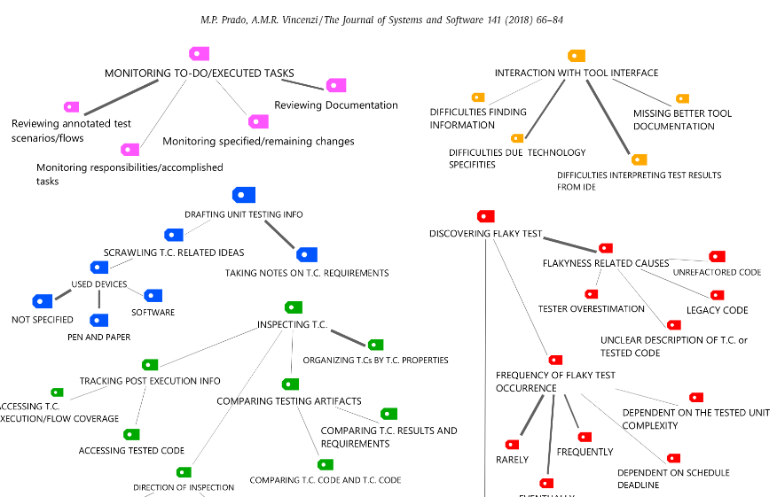

# 📕 | Phd's Artifacts

                                                              
  

  

<section>
  

 

In this project I identified and characterized a research problem regarding the lack of user research for testing tools. I planned, conducted, and analyzed a qualitative study of practitioners to further understand the problem in the unit testing domain. The project's results and contributions include a framework and research agenda. They serve as actionable instruments for the testing community to incorporate practical improvements in cognitive support provided by current and future testing tools. Cognitive support is a key concept in offloading the users' memory during tools usage and has a direct impact on the improvement of the user experience during the tasks performed.

  

</section>  
  
<section>
<h2> Publications </h2>
<ul>
<li>
<a href="https://github.com/pradoprojects/Phd_Artifacts/blob/main/Main-publication-JSS-2018.pdf" target="_blank"> Link to my Main Publication (JSS, 2018). </a>
</li>

<li>
<a href="https://github.com/pradoprojects/Phd_Artifacts/blob/main/Prado_IWPD_ISSRE_2016.pdf" target="_blank"> Characterization of lack of cognitive support in visualization testing tools (ISSRE, 2016). </a>
</li>

<li>
<a href="https://github.com/pradoprojects/Phd_Artifacts/blob/main/Prado_ISSRE_2015.pdf" target="_blank"> Lack of research on human factors for software testing tools (ISSRE, 2015). </a>
</li>
  
</ul>
</section>                                                                                                                  

<section>
<h2> Useful Links </h2>
<ul>
<li>
<a href="https://ww2.inf.ufg.br/sites/default/files/uploads/doutorado/Tese_corrigida_Marllos_Paiva_Prado.pdf" target="_blank"> Doctoral dissertation (UFG, 2018). </a>
</li>

<li>
<a href="https://github.com/pradoprojects/Phd_Artifacts/blob/main/Paiva%20Prado%2C%20Marllos%20-%20ECA%20Report%20(1).docx.pdf" target="_blank"> PhD Credential Assessment by University of Toronto (Canada). </a>
</li>

  
</ul>
</section>                                                                                                                  

                                                                                              

